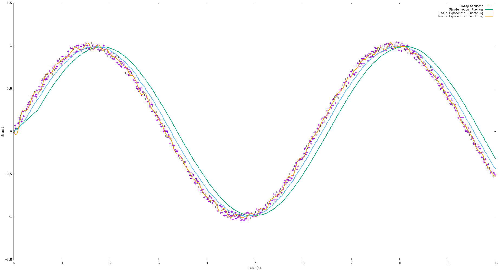

# Moving Average and Exponential smoothing Filters

[](https://opensource.org/licenses/MIT)

### [WIP] WARNING: Wrappers are not yet operational

This repository regroups 4 moving average filters.
These filters have been designed to perform an online smoothing of real-time data (Ex: Data from a sensor).
All the following equations have been extracted from [Moving Average](https://en.wikipedia.org/wiki/Moving_average)
and [Exponential Smoothing](https://en.wikipedia.org/wiki/Exponential_smoothing).

## Basic Moving Average

### Inputs

* Sampling frequency (Hz)
* Duration over which averaging is to be performed (s)

From these two parameters, we can determine the number of points on which we can apply smoothing.
(A static assertion in the constructor checks if the subset size computed is null or not)

### Computation

#### Cumulative moving average

Until reaching the subset size wanted, we perform a cumulative moving average using the following recursive
relationship between the current and the previous mean:

$m_{n} = \frac{1}{n+1}.(n.m_{n-1} + x_{n})$, where $x_{n}$ represents the discrete signal to filter and $m_{n}$ the
average.

#### Simple Moving average

Once the subset has the required size, we perform the simple moving average using the following recursive equation:

$m_{n} = m_{n-1} + \frac{x_{n} - x_{n-1-L}}{L}$ where $L$ represents the subset size.

## Simple Moving Median

### Inputs

* Sampling frequency (Hz)
* Duration over which averaging is to be performed (s)

  From these two parameters, we can determine the number of points on which we can apply smoothing.

(A static assertion in the constructor checks if the subset size computed is null or not)

### Computation

#### Cumulative moving average

Until reaching the subset size wanted, we perform a cumulative moving average using the following recursive
relationship between the current and the previous mean:

$m_{n} = \frac{1}{n+1}.(n.m_{n-1} + x_{n})$, where $x_{n}$ represents the discrete signal to treat and $m_{n}$ the
average.

#### Simple Moving median

Once the subset has the required size, we compute its median and make it "slide".

### Remark

This method may be both more memory and time-consuming than the others because to compute the median we realize a copy
of the
subset and then sort it.

## Simple Exponential Smoothing

### Remark

In the following exponential smoothing filters, we don't exploit their full potential of forecasting more than one step
beyond the current signal.
Indeed, in our case, we want the smoothed value of the last signal value.

However, we can imagine going further using data fusion to take into account all the forecasted values.

### Input

* Data smoothing factor $\alpha \in [0,1]$ (A static assertion in the constructor checks if it's in the right interval)

### Computation

#### Initialization

We use a boolean flag to check if the data given is the first one or not.

$s_{0} = x_{0}$

#### Recursive relationship

Then, for each new item of data, we compute the smoothed value $s_{t}$ thanks to the following equation:

$s_{t} = \alpha.x_{t} + (1-\alpha).s_{t-1}$

## Double Exponential Smoothing

### Input

* Data smoothing factor $\alpha \in [0,1]$ (A static assertion in the constructor checks if it's in the right interval)
* Trend smoothing factor $\beta \in [0,1]$ (A static assertion in the constructor checks if it's in the right interval)

### Computation

#### Initialization

We use boolean flags to initialize these two values.

$s_{0} = x_{0}$

$b_{0} = x_{1} - x_{0}$

#### Recursive relationship

Then, for each new item of data, we compute the smoothed value $s_{t}$ thanks to the following equation:

$s_{t} = \alpha.x_{t} + (1-\alpha).(s_{t-1}+b_{t-1})$

$b_{t} = \beta.(s_{t}-s_{t-1}) + (1-\beta).b_{t-1}$

## Results

#### SMA with a window of $0.5s$

#### SES with $\alpha = 0.08$

#### DES with $\alpha = 0.08$ and $\beta = 0.84$



## Usage [Working for 1D signals]/[Wrappers are coming]

1. Include the header corresponding to the filter you want to use

```cpp
#include "SimpleMovingAverage.hpp"
```

2. Type of ```Signal``` that corresponds to the traits checked in ```TemporalSmoother``` (integers, numerical, Eigen
   matrices...). You can add an allocator for
   the filters such as SMA which needs one.

```cpp
using SimpleMovingAverageType = SimpleMovingAverage<Signal>;
```

3. Instantiate the filter using the inputs given in the sections above:

```cpp
SimpleMovingAverageType movingFilter{samplingFrequency, subsetDuration};
```

4. When a new item of data is available, use the ```operator+()``` to filter it.

```cpp
const auto filteredValue{movingFilter + lastSignalData };
```

These methods are common to all the filters.